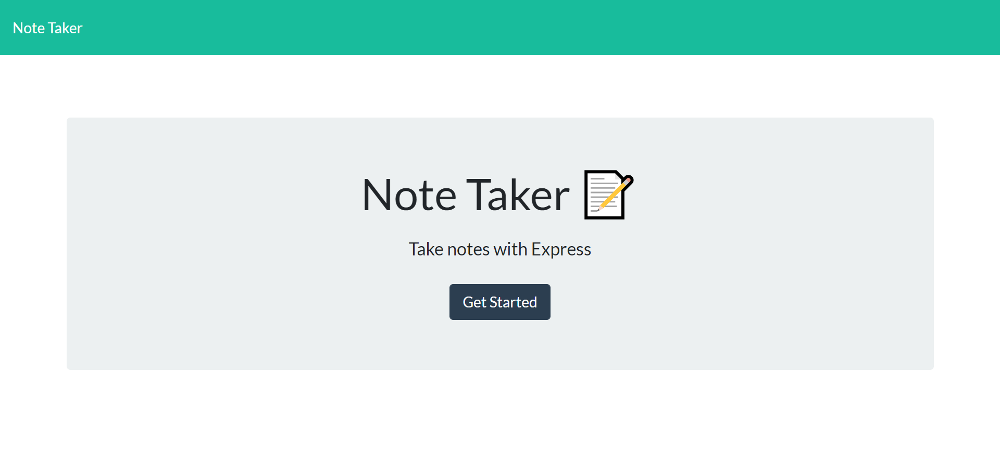
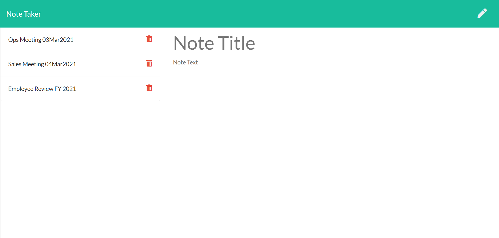
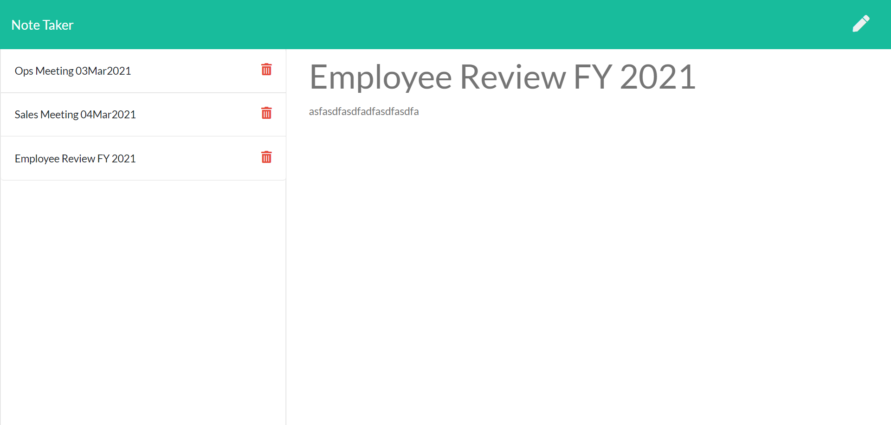

# note-taker

Built with Express for full back-end functionality and data storage.

---
    
## Description

The Note Taker is an application that allows users to write, save, and delete notes that can be easily stored and retrieved from a remote server. The notes are saved via JSON objects that each have a unique Id attributed to them (via Uniqid's npm package) for back-end retrieval. The server is run using Express.js which allows for efficient storage via Express' middleware technology. 

A live version of the application can be found via 

Example screenshots of the application can also be found below: 

---
    
## Table of Contents
    
* [Installation](#installation)
    
* [Usage](#usage)
    
* [License](#license)
    
* [Contribution](#contributions)
    
* [Tests](#tests)
    
* [Questions](#questions)
    
---
    
## Installation

No installation requirements are needed for this application. All node server packages are stored on heroku.

---
    
## Usage
    
No usage notes are needed for this application.

---
    
   
## License
        
This project is licensed under the [MIT](https://opensource.org/licenses/MIT) license. Follow the link for further information regarding this license. 
        
---     
    
## Contributions
    
If you wish to contribute to this project, contact Jonathan Stoll via GitHub a [Jon's GitHub](https://github.com/jonathanstoll0603)

1. Ensure any install or build dependencies are removed before the end of the layer when doing a build.

2. Update the README.md with details of changes to the interface, this includes new environment variables, exposed ports, useful file locations and container parameters.

3. Increase the version numbers in any examples files and the README.md to the new version that this Pull Request would represent. 
    
---
    
## Tests
    
No tests are needed for this application.

---
    
## Questions
    
For any questions, please contact us via email at Jonathanstoll0603@gmail.com, or GitHub at Jonathanstoll0603.
    
---   